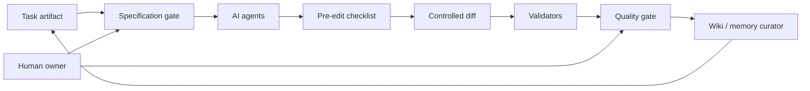
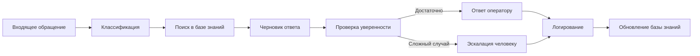
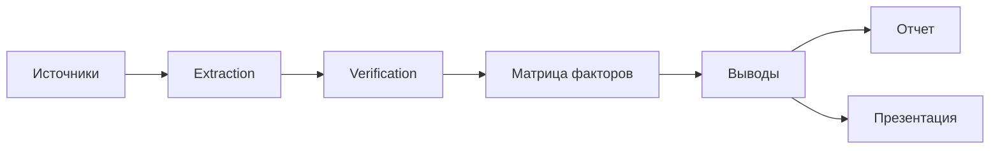
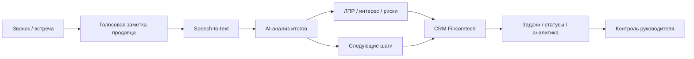
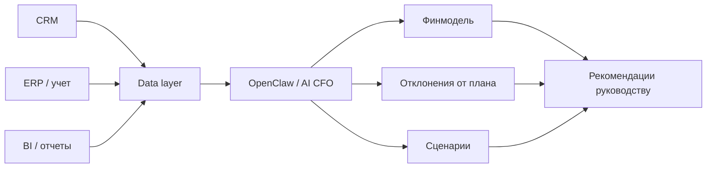
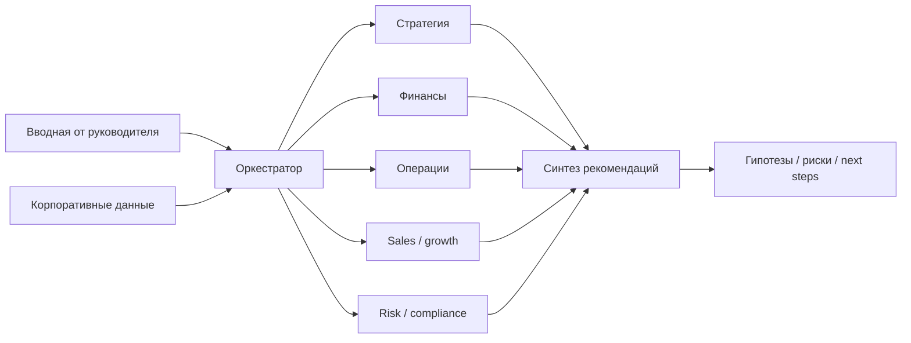

# Портфолио AI / Automation

## Задача портфолио

Это портфолио показывает опыт внедрения AI и автоматизации без раскрытия клиентов, внутренних данных и деталей проектов под NDA.

Фокус не на эффектных иллюстрациях, а на доказательстве практического опыта:

- есть реальный опыт внедрения AI / automation в рабочих процессах;
- есть понимание процессов, архитектуры, качества и ограничений;
- AI рассматривается не как магия, а как управляемый инструмент;
- решения проектируются с учетом людей, рисков, данных и контроля результата.

Каждый кейс описан через контекст, проблему, роль, подход, результат, ограничения и подтверждаемые навыки.

---

## Кейс 1. AI-native SDLC / ASDLC

### AI-native SDLC: управляемый цикл разработки с ИИ-агентами

**Кратко:** спроектировал и внедрил подход к разработке, где спецификация, контекст задачи, guardrails, gates и AI-агенты работают как единый управляемый контур.

**Проблема:** AI-инструменты ускоряют разработку, но без процесса создают хаос: agent drift, расползание scope, лишние изменения в коде, потерю контекста, слабую проверяемость решений и устаревшую проектную память.

**Решение:** создан контур AI-native SDLC:

- task artifact как единое состояние задачи;
- SDD как база для управления контекстом;
- explicit understanding / specification gates;
- skill registry;
- pre-edit checklist;
- quality gates;
- wiki / memory curator;
- validators;
- контролируемая diff discipline.

**Где внедрено:** аутсорсинговая IT-компания, NDA; стартап Финкомтех, enterprise software / ERP / SCADA / BI контур; второй AI / automation стартап, NDA.

**Моя роль:** автор подхода, архитектор процесса, внедрение и адаптация под реальные команды и проекты.

**Результат:** разработка с AI стала более управляемой: задачи лучше специфицируются, контекст меньше теряется, изменения проще проверять, а качество не зависит только от удачного промпта.

**Стек / подходы:** AI-assisted development, LLM agents, SDD, gates, validators, wiki / memory, diff discipline, quality control.

**Ограничения:** детали клиентов, код и внутренние процессы не раскрываются из-за NDA. Могу показать безопасную схему подхода без клиентских данных.

**Что подтверждает:** зрелый подход к AI-assisted development, понимание разработки и качества, умение строить операционную модель, а не набор промптов.

---

## Кейс 2. AI-оркестратор службы поддержки

### AI-оркестратор поддержки: заявки, база знаний и контроль качества

**Кратко:** концепция и реализация AI-ассистента, который помогает обрабатывать обращения, находить ответы в базе знаний, готовить черновики ответов и эскалировать сложные случаи человеку.

**Проблема:** поддержка теряет время на однотипные запросы, ручную классификацию обращений, поиск информации в разных источниках, повторяющиеся ответы и слабую передачу контекста между сотрудниками.

**Решение:** спроектирован workflow, в котором AI помогает на конкретных этапах процесса:

- классификация обращений;
- поиск по базе знаний;
- генерация черновика ответа;
- проверка уверенности;
- эскалация человеку;
- сохранение новых знаний;
- логирование решений.

**Моя роль:** архитектура решения, проектирование workflow, критерии качества, сценарии взаимодействия человека и AI.

**Результат:** AI не заменяет поддержку, а снимает повторяющуюся нагрузку, ускоряет подготовку ответов и помогает накапливать знания в управляемом виде.

**Стек / подходы:** LLM, RAG, база знаний, human-in-the-loop, CRM / helpdesk, API, Telegram / email, логирование, контроль качества.

**Ограничения:** без раскрытия клиента, реальных обращений, базы знаний и внутренних метрик.

**Что подтверждает:** опыт применения AI в реальном процессе поддержки, human-in-the-loop, контроль качества вместо подхода «бот отвечает как хочет».

---

## Кейс 3. AI-assisted research pipeline

### AI-assisted research pipeline для больших аналитических исследований

**Кратко:** подход к исследовательским проектам, где AI помогает обрабатывать большие объемы публичной и закрытой информации, но выводы строятся через проверяемую структуру, источники и контроль качества.

**Проблема:** большие исследования быстро превращаются в хаос: десятки источников, разные форматы, слабая доказательность, ручное копирование, риск «текста от AI без фактов», сложная сборка отчета и презентации.

**Решение:** создан исследовательский pipeline:

- структура исследования;
- матрица стран / рынков / продуктов / факторов;
- сбор источников;
- извлечение фактов;
- проверка ссылок;
- подготовка черновиков разделов;
- сбор выводов, отчета и презентации.

**Моя роль:** архитектор исследовательского процесса, проектирование AI-assisted workflow, контроль качества и структура deliverables.

**Результат:** исследование становится воспроизводимым: факты отделены от интерпретаций, источники проверяемы, а AI ускоряет аналитику без подмены мышления.

**Стек / подходы:** LLM, research workflow, extraction, verification, source tracking, matrices, reports, slides, BI-style structuring.

**Ограничения:** без раскрытия закрытых источников, клиентов и внутренних материалов.

**Что подтверждает:** работа с большими объемами информации, системная аналитика, использование AI как усилителя аналитика.

---

## Кейс 4. CRM, голосовые боты и AI-автоматизация продаж

### Интеграция CRM с голосовыми ботами и AI-агентами для sales-процесса

**Кратко:** реализация AI/automation-контура вокруг CRM Fincomtech: голосовые боты, AI-агенты, аналитика по лидам, поиск ЛПР, обработка голосовых заметок продавцов и автоматические действия в CRM.

**Проблема:** в B2B-продажах много ценной информации теряется между звонками, встречами, заметками продавцов и CRM. Менеджеры вручную заносят данные, забывают обновлять статусы, слабо структурируют итоги встреч, а руководству трудно видеть реальное качество лидов и следующую лучшую активность.

**Решение:** спроектирован и реализован контур, где AI помогает связывать коммуникации, аналитику и CRM-действия:

- интеграция CRM Fincomtech с голосовыми ботами;
- сбор и структурирование аналитики по лидам;
- поиск и обогащение информации по ЛПР;
- обработка голосовых заметок продавцов после встреч;
- извлечение итогов, обязательств, рисков и следующих шагов;
- автоматическое создание задач, обновление карточек и статусов в CRM;
- контроль качества и сценарии ручного подтверждения для чувствительных действий.

**Моя роль:** архитектура AI/CRM-контура, проектирование workflow, интеграции, сценарии обработки данных, критерии качества и логика human-in-the-loop.

**Результат:** CRM становится не только местом ручного ввода, а рабочим контуром принятия решений: коммуникации превращаются в структурированные данные, продавцы меньше тратят времени на рутину, а руководитель получает более прозрачную картину по лидам и действиям команды.

**Стек / подходы:** CRM, API, webhooks, voice bots, speech-to-text, LLM agents, lead analytics, enrichment, sales workflow, human-in-the-loop, автоматизация задач.

**Ограничения:** без раскрытия клиентских данных, внутренних CRM-экранов, коммерческих деталей и реальных лидов.

**Что подтверждает:** опыт AI-автоматизации в реальном sales-процессе, интеграции с CRM, работу с голосовыми данными, понимание B2B-продаж и управляемое внедрение AI в операционный контур.

---

## Кейс 5. Виртуальный финансовый директор

### Виртуальный CFO на базе OpenClaw и корпоративных данных

**Кратко:** реализация виртуального финансового директора, который собрал финансовую модель для инвесторов, перед этим последовательно уточнив вводные, допущения, источники данных и логику расчетов через серию предметных вопросов.

**Проблема:** финансовая модель для инвесторов не должна быть красивой таблицей «из воздуха». Нужны понятные вводные, проверяемые допущения, связь с реальными данными бизнеса и логика, которую можно объяснить. Обычно это требует много ручной подготовки, итераций и уточнений между основателем, финансистом и аналитиком.

**Решение:** создан AI-контур виртуального CFO, который работает не как генератор таблиц, а как требовательный финансовый собеседник:

- подключение к корпоративным источникам данных;
- сбор выручки, расходов, планов, фактических показателей и операционных метрик;
- серия уточняющих вопросов по бизнес-модели, допущениям и ограничениям;
- подготовка и обновление финансовых моделей;
- анализ отклонений от плана;
- сценарное моделирование;
- формирование пояснений для руководства;
- корректировка модели при изменении вводных или новых данных из корпоративных систем.

**Моя роль:** архитектура решения, проектирование агентного workflow, логика доступа к данным, структура финансовых моделей, критерии качества и сценарии использования для руководства.

**Результат:** виртуальный CFO подготовил финансовую модель, пригодную для инвесторского контура. Сильная часть решения не только в генерации модели, а в том, что агент заставляет формализовать мышление: задает неудобные вопросы, проверяет вводные, уточняет экономику и помогает превратить размышления основателя в структуру, с которой можно идти к инвесторам.

**Стек / подходы:** OpenClaw, LLM agents, корпоративные источники данных, CRM / ERP / BI, финансовое моделирование, scenario planning, data connectors, governance.

**Ограничения:** без раскрытия корпоративных данных, финансовых показателей, архитектурных деталей и внутренних моделей.

**Что подтверждает:** опыт построения AI-агентов для управленческого и финансового контура, работу с корпоративными данными, сценарное моделирование, подготовку investor-ready материалов и понимание качества в high-stakes decision support.

---

## Кейс 6. Виртуальный совет директоров

### Multi-agent board: AI-советники для стратегических решений

**Кратко:** реализация виртуального «совета директоров» из AI-агентов, который регулярно помогает критиковать, доформулировать и структурировать управленческие размышления по развитию MedVoice, Fincomtech и других проектов.

**Проблема:** предпринимателям и руководителям часто не хватает доступного стратегического оппонента: кто-то должен проверить идею, найти слабые места, посмотреть на данные с разных сторон, сформулировать риски и предложить следующий шаг. Особенно на ранних стадиях у проекта может не быть полноценного совета директоров, но потребность в критике, доформулировании и стратегическом споре уже есть.

**Решение:** создан multi-agent контур, где разные AI-роли анализируют одну управленческую задачу с разных позиций:

- стратегический советник;
- финансовый советник;
- операционный советник;
- sales / growth советник;
- risk / compliance позиция;
- критик гипотез;
- синтезатор итоговой рекомендации.

Агенты получают вводные от руководителя, обращаются к доступному контексту и корпоративным данным, формируют гипотезы, спорят с предпосылками, критикуют слабые места, доформулируют мысль и собирают рекомендации в понятный управленческий формат.

**Моя роль:** концепция продукта, архитектура multi-agent workflow, проектирование ролей агентов, контекста, доступа к данным, формата рекомендаций и ограничений безопасности.

**Результат:** руководитель получает «совет директоров в кармане»: постоянного виртуального оппонента, который помогает думать яснее, формулировать точнее, видеть слабые места и быстрее готовить решения. Это особенно полезно там, где AI уже способен быть не просто исполнителем, а инструментом мышления и управленческого диалога.

**Стек / подходы:** LLM agents, multi-agent orchestration, corporate data access, RAG, role-based reasoning, decision support, strategic analysis, risk analysis.

**Ограничения:** без раскрытия корпоративных данных, конкретных стратегических вопросов, внутренних документов и клиентских сценариев.

**Что подтверждает:** умение проектировать сложные agentic-системы, работать с управленческим контекстом, превращать AI в decision-support инструмент и учитывать ограничения доверия, качества и доступа к данным.

---

## Кейс 7. MedTech / AI pilot

### AI / MedTech пилот в клиническом контуре

**Кратко:** участие в запуске AI / MedTech решения, проходящего пилотирование в нескольких клиниках РФ. Детали ограничены NDA и чувствительностью домена.

**Проблема:** в медицинском контуре AI нельзя внедрять как игрушку: высокая цена ошибки, чувствительные данные, требования к качеству, необходимость понятного результата для специалистов и ограничения по интеграциям.

**Решение:** работа велась вокруг практического сценария:

- проектирование применимого workflow;
- контроль качества;
- подготовка к пилотной эксплуатации;
- работа с ограничениями домена;
- минимизация ручного труда без потери контроля.

**Моя роль:** сооснователь / архитектор, AI / LLM workflow, подготовка к пилотной эксплуатации.

**Результат:** решение рассматривается не как демо, а как пилот в чувствительном домене, где важны качество, безопасность, понятность и контролируемое внедрение.

**Стек / подходы:** AI / LLM workflow, MedTech, pilot operations, quality control, human-in-the-loop, sensitive data constraints.

**Ограничения:** без раскрытия клиник, данных, медицинских деталей и внутренней архитектуры.

**Что подтверждает:** production / pilot thinking, понимание рисков, опыт работы в чувствительном домене.

---

## Короткие карточки для площадок

### AI-native SDLC / ASDLC

Внедрение управляемого цикла разработки с AI-агентами: task artifact, specification gates, skill registry, validators, wiki / memory и контроль scope. Подход применен в аутсорсинговой IT-компании и собственных стартапах.

### AI-ассистенты для процессов

Проектирую ассистентов не как «чат-ботов», а как рабочие контуры: источники данных, сценарии, качество ответов, эскалация человеку, интеграции с CRM / API / Telegram и понятная инструкция для сотрудников.

### AI + CRM для продаж

Интеграция CRM с голосовыми ботами и AI-агентами: обработка голосовых заметок продавцов, аналитика по лидам, поиск ЛПР, извлечение следующих шагов и автоматические действия в CRM с контролем качества.

### Виртуальный финансовый директор

AI-контур на базе OpenClaw для сбора данных из корпоративных систем, формирования финансовых моделей, анализа отклонений и корректировки сценариев на лету по новым данным из CRM / ERP / BI.

### Виртуальный совет директоров

Multi-agent система для руководителей: разные AI-роли анализируют управленческую задачу, проверяют гипотезы, смотрят на корпоративные данные, выделяют риски и собирают рекомендации в понятный формат.

### AI-аудит и discovery

Помогаю понять, где AI действительно нужен, а где достаточно обычной автоматизации. Результат: карта сценариев, риски, MVP, ориентир по срокам и бюджету.

### AI / MedTech пилот

Опыт запуска AI-решения в медицинском контуре, проходящего пилотирование в клиниках РФ. Фокус: качество, безопасность, практическая польза и контролируемое внедрение.

---

## Визуальные материалы

Визуальные материалы должны быть безопасными: без логотипов клиентов, реальных данных, внутренних экранов и узнаваемых фрагментов систем.

Рекомендуемые форматы:

- 16:9 для сайта, презентаций и широких карточек;
- 1:1 для Авито, Профи и социальных площадок.

### 1. Диаграмма AI-native SDLC

### 2. Схема AI-оркестратора поддержки

### 3. Research pipeline

### 4. AI + CRM sales workflow

### 5. Виртуальный CFO

### 6. Виртуальный совет директоров

### 7. Before / After карточка

| Было | Стало |
| --- | --- |
| Ручные операции | Process map |
| Разрозненные сервисы | MVP-контур |
| Нет критериев качества | Quality gates |
| Непонятный scope | Декомпозиция по версиям |
| AI как эксперимент | AI как управляемый workflow |
| CRM как ручной журнал | CRM как decision-support контур |
| Статичная финмодель | Живая модель на корпоративных данных |

---

## Формулировки, которых лучше избегать

Не использовать:

- «лучший эксперт»;
- «любой ИИ под ключ»;
- «нейросеть заменит сотрудников»;
- «гарантирую рост продаж»;
- «делаю все»;
- NDA как оправдание пустоты.

Лучше использовать:

- «детали под NDA, но могу описать архитектурный подход»;
- «покажу безопасный пример без клиентских данных»;
- «начинаю с пилота и критериев качества»;
- «помогаю отделить AI-сценарии от обычной автоматизации»;
- «проектирую workflow, качество и эскалацию человеку».
